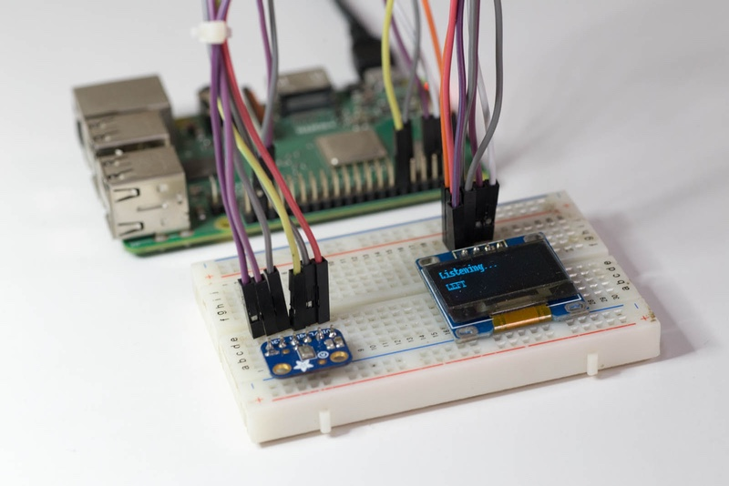

This example adapts the official TensorFlow simple audio recognition example to use live audio data from an I2S microphone on a Raspberry Pi.

You can find a detailed blog article about this project here:

https://electronut.in/audio-recognition-raspberry-pi-tensorflow-lite/

